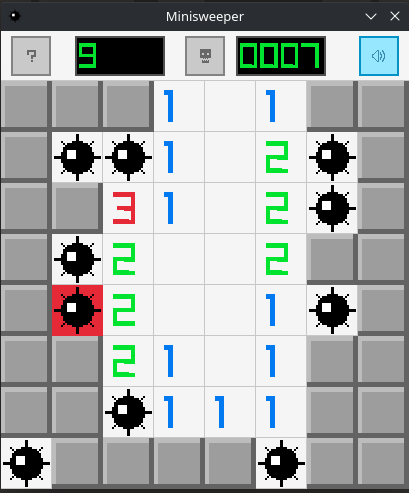

# minisweeper

A minesweeper clone made entirely with [raylib](https://github.com/raysan5/raylib) and [raygui](https://github.com/raysan5/raygui).

I made this while playing around with raylib and had it lying around for later optimizations :wink: . So I decided to share it rather than let it lie around forever.

    

There are still a couple of things that have to be done with it.

* I never run it on Windows
* I never built it for wasm

Other than that, one should not have any problems to run it on a linux machine.

* You will need raylib installed
* You need Cmake and g++ installed
* I am shipping the raygui header with this code (because reasons)

If you have all the above covered, just run `build.sh`. I am also adding my `.vscode` folder so you should be able to debug it in vscode.